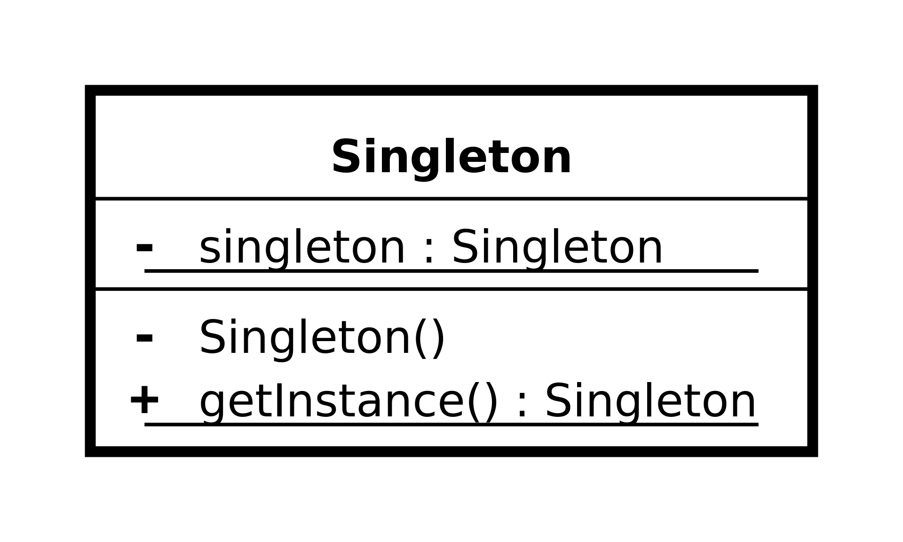
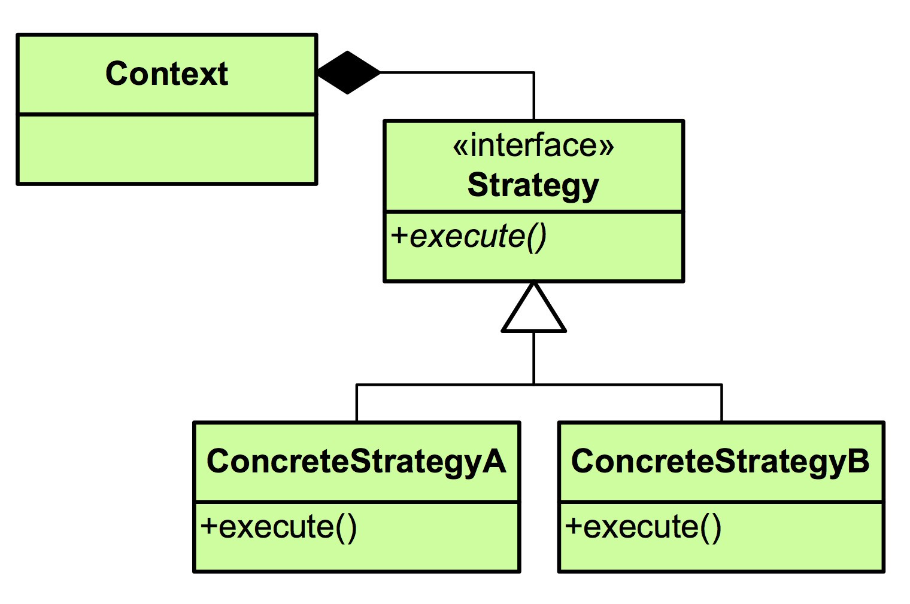

# İkinci ödev teslim tarihi : 22 Ağustos - 23:00
### Not : ARAŞTIRMA KONUSU kısmı tamamıyla sizleri geliştirmek amaçlı , eklenmiştir , o madde için herhangi bir kod vs örneğine ihtiyaç yoktur.

---

##Tasarım kalıpları nelerdir?
Belirli problemler için üretilmiş bazı kalıplardır. Bu kalıplar benzer problemleri çözmek oluşturulmuş herkes tarafından kabul gören çözümlerdir. Bu çözümler geliştiricilerin standartlarından biridir. İlgili yazılım dili bilinmese bile UML diagramları ile ortak bir iletişim dili oluşturulmuştur. Genel anlamda Tasarım kalıpları 3 kategoriye bölünür.
###Yaratımsal Kalıplar
Nesnelerin oluşturulmasında ve yönetilmesinde kullanılan bir desendir. Bu program akışında hangi nesneye ihtiyaç varsa onu oluşturmada esneklik ve kolaylık sağlar.
###Yapısal Kalıplar
Birden fazla sınıfın bir işi yerine getirirken nasıl davranacağını belirlemek için kullanılan desenlerdir. 
###Davranışsal Kalıplar
Nesnelerin birbirleri ile ilişkisini düzenleyen desendir.

---

##Singleton tasarım kalıbı

Singleton tasarım kalıında yanlızca bir nesne üretildiğinin garanti edildiği kalıptır.private construction methodu ile özgürce objenin üretlmesi engellenir. statik getInitiate() methodu ile eğer obje yaratılmamışsa yaratılır ve return olarak kendi objesini gönderir. Bunun kullanım alanı genellik resource objelerinin statikte oluşturulması doğru karşılanmaz. Java yaşam döngüsü içerisinde olması istenir. Ama bir tane üretildiğinden emin olmakta isteriz. Bu sorunu çözmenin en güzel yöntemi Singleton kalıbıdır.

---

##Facade tasarım kalıbı
Facade tasarım kalıbı birden çok sınıfı veya interface'i bir arada kullanmamızı sağlayan bir tasarım kalıbıdır. Bu sayade alt katmandaki sınıflar birbirinden bağımsız olabilmektedir ve ayrı ayrı geliştirileilir. Çok genel bir tasarım kalıbı olduğundan UML diagramı her senaryo için çok farklı olabilir.

---

##Strategy tasarım kalıbı

Strategy tasarım kalıbı aynı katmanda kullanılabilen birbirinden farklı methodlar oluşturmamızı ve bunu program içinde değiştirebilmemizi sağlar.
